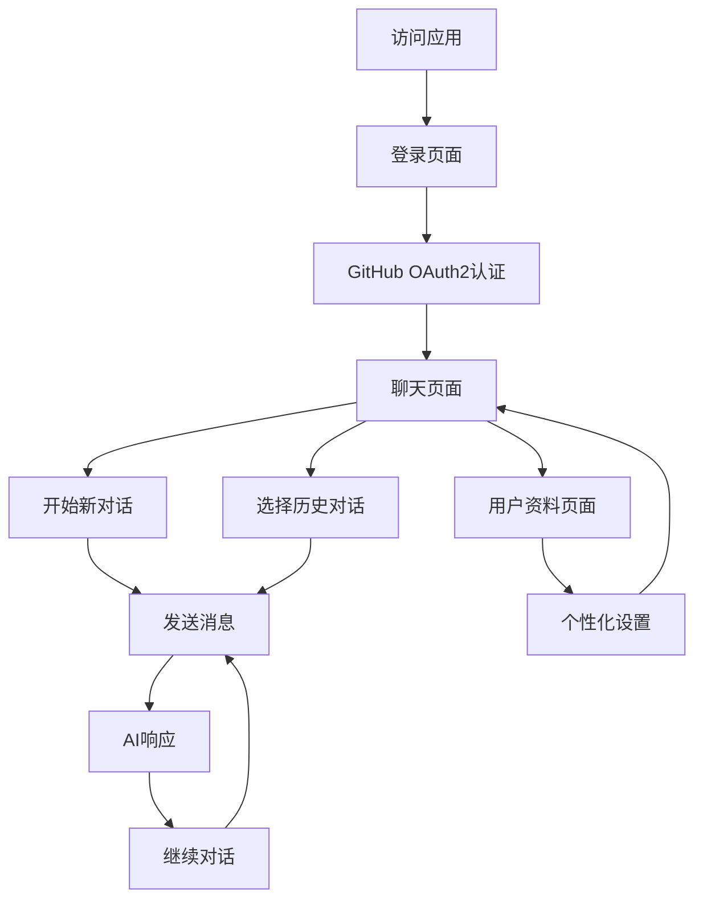

# AI聊天应用产品需求文档

## 1. 产品概述

一个基于Vue 3和Vercel的现代化AI聊天应用，支持GitHub OAuth2登录，提供流畅的AI对话体验。
应用采用一体化架构设计，前后端统一部署在Vercel平台，确保高性能和全球访问速度。
目标是为用户提供简洁、安全、高效的AI聊天服务，支持多对话管理和个性化设置。

## 2. 核心功能

### 2.1 用户角色

| 角色 | 注册方法 | 核心权限 |
|------|----------|----------|
| 注册用户 | GitHub OAuth2一键登录 | 可以创建对话、发送消息、管理聊天记录、个性化设置 |

### 2.2 功能模块

我们的AI聊天应用包含以下主要页面：
1. **登录页面**: GitHub OAuth2登录按钮、应用介绍
2. **聊天页面**: 对话界面、消息列表、输入框、侧边栏
3. **用户资料页面**: 个人信息、偏好设置、账户管理

### 2.3 页面详情

| 页面名称 | 模块名称 | 功能描述 |
|----------|----------|----------|
| 登录页面 | GitHub登录 | 显示GitHub OAuth2登录按钮，处理用户认证流程 |
| 登录页面 | 应用介绍 | 展示应用特性、使用说明和产品亮点 |
| 聊天页面 | 对话界面 | 显示当前对话的消息历史，支持流式AI响应显示 |
| 聊天页面 | 消息输入 | 提供消息输入框，支持发送文本消息和快捷键操作 |
| 聊天页面 | 对话侧边栏 | 管理多个对话会话，支持创建、删除、重命名对话 |
| 聊天页面 | 用户信息栏 | 显示用户头像、用户名，提供登出和设置入口 |
| 用户资料页面 | 个人信息 | 显示GitHub用户信息，包括头像、用户名、邮箱 |
| 用户资料页面 | 偏好设置 | 主题切换、语言设置、字体大小调整 |
| 用户资料页面 | 账户管理 | 登出功能、数据导出、账户删除选项 |

## 3. 核心流程

### 用户操作流程

用户首次访问应用时，会看到登录页面，点击GitHub登录按钮进行OAuth2认证。认证成功后自动跳转到聊天页面，可以立即开始与AI对话。用户可以在侧边栏管理多个对话，在设置页面个性化应用体验。

## 4. 用户界面设计

### 4.1 设计风格

- **主色调**: 深蓝色 (#1e40af) 和浅蓝色 (#3b82f6)，体现专业和科技感
- **辅助色**: 灰色系 (#6b7280, #f3f4f6) 用于背景和次要元素
- **按钮样式**: 圆角按钮 (rounded-lg)，悬停效果和渐变背景
- **字体**: 系统默认字体栈，支持中英文显示，基础字号14px
- **布局风格**: 现代卡片式设计，左侧边栏 + 主内容区域布局
- **图标风格**: 使用Heroicons图标库，线性风格，保持一致性

### 4.2 页面设计概览

| 页面名称 | 模块名称 | UI元素 |
|----------|----------|---------|
| 登录页面 | GitHub登录 | 居中卡片布局，深色背景，白色登录卡片，GitHub图标按钮，蓝色主题色 |
| 登录页面 | 应用介绍 | 渐变背景，大标题，特性列表，现代插图风格 |
| 聊天页面 | 对话界面 | 白色背景，消息气泡设计，用户消息右对齐蓝色，AI消息左对齐灰色 |
| 聊天页面 | 消息输入 | 底部固定输入框，圆角边框，发送按钮，支持多行输入 |
| 聊天页面 | 对话侧边栏 | 左侧固定宽度，深色背景，对话列表，悬停高亮效果 |
| 聊天页面 | 用户信息栏 | 顶部导航栏，用户头像，下拉菜单，简洁设计 |
| 用户资料页面 | 个人信息 | 卡片式布局，头像居中，信息列表，清晰分割线 |
| 用户资料页面 | 偏好设置 | 开关组件，选择器，滑块控件，即时预览效果 |

### 4.3 响应式设计

应用采用移动优先的响应式设计，在桌面端显示完整的侧边栏布局，在移动端自动收缩为抽屉式导航。支持触摸手势操作，优化移动设备的交互体验。所有按钮和交互元素都针对触摸操作进行了优化。

