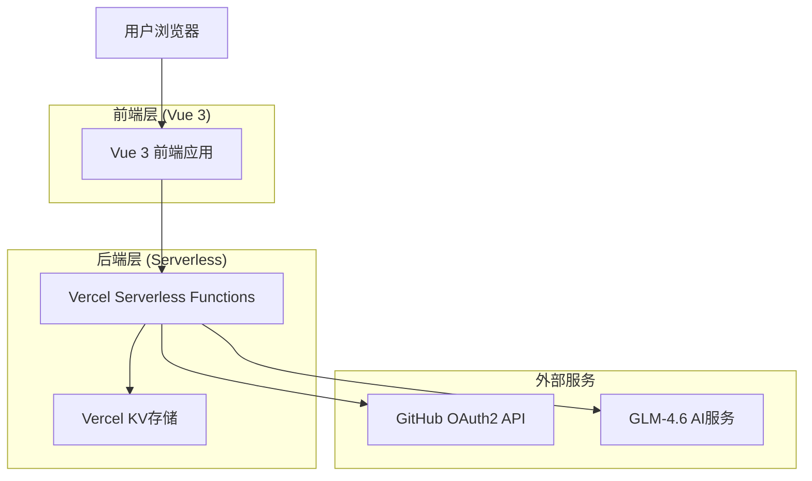
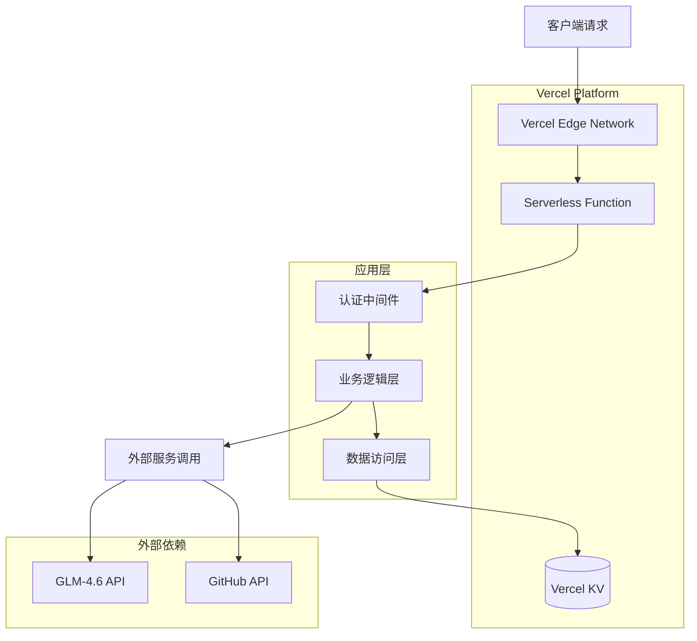
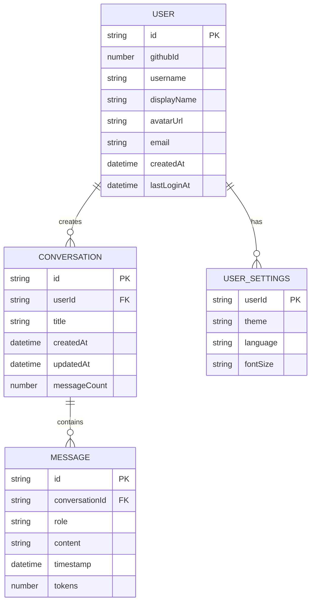

# AI聊天应用技术架构文档

## 1. 架构设计



## 2. 技术描述

- **前端**: Vue 3 + TypeScript + Vite + TailwindCSS + Pinia + Vue Router 4
- **后端**: Vercel Serverless Functions (Node.js 18)
- **数据存储**: Vercel KV (Redis)
- **认证**: GitHub OAuth2
- **AI服务**: GLM-4.6 API
- **部署**: Vercel Platform

## 3. 路由定义

| 路由 | 用途 |
|------|------|
| / | 首页，自动重定向到聊天页面或登录页面 |
| /login | 登录页面，GitHub OAuth2认证入口 |
| /chat | 聊天页面，主要的AI对话界面 |
| /profile | 用户资料页面，个人信息和设置管理 |

## 4. API定义

### 4.1 认证相关API

**GitHub OAuth登录**
```
GET /api/auth/github
```
- 重定向到GitHub授权页面
- 生成state参数防止CSRF攻击

**OAuth回调处理**
```
GET /api/auth/github/callback
```

请求参数:
| 参数名 | 参数类型 | 是否必需 | 描述 |
|--------|----------|----------|------|
| code | string | true | GitHub返回的授权码 |
| state | string | true | CSRF防护状态参数 |

响应:
| 参数名 | 参数类型 | 描述 |
|--------|----------|------|
| success | boolean | 认证是否成功 |
| token | string | JWT访问令牌 |
| user | object | 用户基本信息 |

示例响应:
```json
{
  "success": true,
  "token": "eyJhbGciOiJIUzI1NiIsInR5cCI6IkpXVCJ9...",
  "user": {
    "id": "12345",
    "username": "johndoe",
    "displayName": "John Doe",
    "avatarUrl": "https://avatars.githubusercontent.com/u/12345"
  }
}
```

**用户登出**
```
POST /api/auth/logout
```

请求头:
| 参数名 | 参数类型 | 是否必需 | 描述 |
|--------|----------|----------|------|
| Authorization | string | true | Bearer JWT令牌 |

响应:
| 参数名 | 参数类型 | 描述 |
|--------|----------|------|
| success | boolean | 登出是否成功 |

### 4.2 聊天相关API

**获取对话列表**
```
GET /api/chat/conversations
```

请求头:
| 参数名 | 参数类型 | 是否必需 | 描述 |
|--------|----------|----------|------|
| Authorization | string | true | Bearer JWT令牌 |

响应:
| 参数名 | 参数类型 | 描述 |
|--------|----------|------|
| conversations | array | 对话列表 |

**创建新对话**
```
POST /api/chat/conversations
```

请求:
| 参数名 | 参数类型 | 是否必需 | 描述 |
|--------|----------|----------|------|
| title | string | false | 对话标题，默认自动生成 |

响应:
| 参数名 | 参数类型 | 描述 |
|--------|----------|------|
| id | string | 新创建的对话ID |
| title | string | 对话标题 |
| createdAt | string | 创建时间 |

**发送消息**
```
POST /api/chat/send
```

请求:
| 参数名 | 参数类型 | 是否必需 | 描述 |
|--------|----------|----------|------|
| conversationId | string | true | 对话ID |
| message | string | true | 用户消息内容 |

响应:
- 流式响应 (Server-Sent Events)
- Content-Type: text/event-stream

示例请求:
```json
{
  "conversationId": "conv_12345",
  "message": "你好，请介绍一下人工智能的发展历史"
}
```

### 4.3 用户相关API

**获取用户信息**
```
GET /api/user/profile
```

请求头:
| 参数名 | 参数类型 | 是否必需 | 描述 |
|--------|----------|----------|------|
| Authorization | string | true | Bearer JWT令牌 |

响应:
| 参数名 | 参数类型 | 描述 |
|--------|----------|------|
| user | object | 用户完整信息 |
| settings | object | 用户偏好设置 |

**更新用户设置**
```
PUT /api/user/settings
```

请求:
| 参数名 | 参数类型 | 是否必需 | 描述 |
|--------|----------|----------|------|
| theme | string | false | 主题设置 (light/dark) |
| language | string | false | 语言设置 (zh/en) |
| fontSize | string | false | 字体大小 (small/medium/large) |

## 5. 服务器架构图



## 6. 数据模型

### 6.1 数据模型定义



### 6.2 数据定义语言

**用户表 (users)**
```sql
-- Vercel KV 键值存储结构
-- Key: user:{userId}
-- Value: JSON对象
{
  "id": "user_12345",
  "githubId": 12345,
  "username": "johndoe",
  "displayName": "John Doe",
  "avatarUrl": "https://avatars.githubusercontent.com/u/12345",
  "email": "john@example.com",
  "createdAt": "2024-01-01T00:00:00Z",
  "lastLoginAt": "2024-01-01T00:00:00Z"
}

-- 索引键
-- Key: github:{githubId} -> Value: userId
-- Key: username:{username} -> Value: userId
```

**对话表 (conversations)**
```sql
-- Key: conversation:{conversationId}
-- Value: JSON对象
{
  "id": "conv_12345",
  "userId": "user_12345",
  "title": "关于AI的讨论",
  "createdAt": "2024-01-01T00:00:00Z",
  "updatedAt": "2024-01-01T00:00:00Z",
  "messageCount": 10
}

-- 用户对话列表
-- Key: user_conversations:{userId}
-- Value: 对话ID数组 ["conv_12345", "conv_67890"]
```

**消息表 (messages)**
```sql
-- Key: conversation_messages:{conversationId}
-- Value: 消息数组
[
  {
    "id": "msg_12345",
    "conversationId": "conv_12345",
    "role": "user",
    "content": "你好，请介绍一下人工智能",
    "timestamp": "2024-01-01T00:00:00Z",
    "tokens": 15
  },
  {
    "id": "msg_67890",
    "conversationId": "conv_12345",
    "role": "assistant",
    "content": "人工智能是计算机科学的一个分支...",
    "timestamp": "2024-01-01T00:00:01Z",
    "tokens": 150
  }
]
```

**用户设置表 (user_settings)**
```sql
-- Key: user_settings:{userId}
-- Value: JSON对象
{
  "userId": "user_12345",
  "theme": "dark",
  "language": "zh",
  "fontSize": "medium"
}
```

**会话管理**
```sql
-- JWT会话存储
-- Key: session:{tokenId}
-- Value: 会话信息，设置TTL过期时间
{
  "userId": "user_12345",
  "createdAt": "2024-01-01T00:00:00Z",
  "expiresAt": "2024-01-08T00:00:00Z"
}
```

**初始化数据**
```sql
-- 系统配置
-- Key: system:config
{
  "version": "1.0.0",
  "maintenance": false,
  "features": {
    "registration": true,
    "chat": true
  }
}

-- API限制配置
-- Key: rate_limit:{userId}:{endpoint}
-- Value: 请求计数，设置TTL重置时间
```