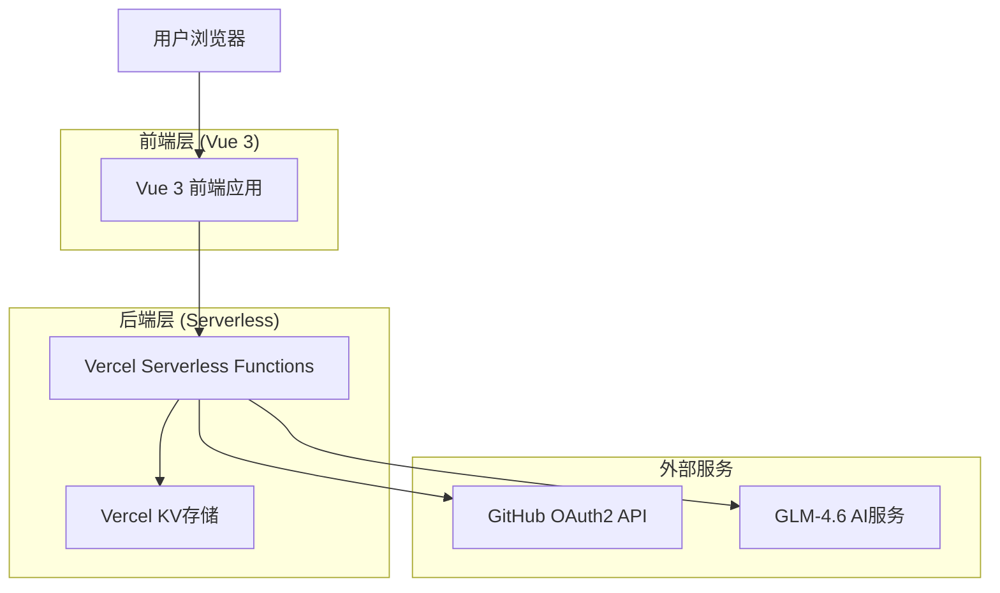

# AI聊天应用一体化重构方案

## 1. 重构目标

将AI聊天应用重构为**前后端一体化的现代Web应用**，支持GitHub OAuth2登录，专门为Vercel部署优化。

### 核心原则
- **一体化架构**：前后端统一开发和部署
- **现代认证**：GitHub OAuth2登录系统
- **云原生部署**：完全适配Vercel平台
- **用户体验优先**：简洁高效的交互设计

## 2. 技术架构设计



## 3. 技术栈选择

### 前端技术栈
- **框架**: Vue 3 + Composition API
- **类型系统**: TypeScript
- **构建工具**: Vite
- **样式框架**: TailwindCSS
- **状态管理**: Pinia
- **路由**: Vue Router 4

### 后端技术栈
- **运行时**: Vercel Serverless Functions (Node.js)
- **认证**: GitHub OAuth2
- **数据存储**: Vercel KV (Redis)
- **AI服务**: GLM-4.6 API集成

### 部署平台
- **主平台**: Vercel
- **域名**: 自定义域名支持
- **SSL**: 自动HTTPS
- **CDN**: 全球边缘网络

## 4. 项目结构

```
ai-chat-vercel/
├── api/                          # Vercel Serverless Functions
│   ├── auth/
│   │   ├── github.js            # GitHub OAuth回调
│   │   ├── login.js             # 登录处理
│   │   └── logout.js            # 登出处理
│   ├── chat/
│   │   ├── conversations.js     # 对话管理
│   │   ├── messages.js          # 消息处理
│   │   └── send.js              # 发送消息
│   └── user/
│       └── profile.js           # 用户信息
├── src/                         # Vue前端源码
│   ├── components/              # Vue组件
│   │   ├── chat/
│   │   │   ├── ChatInterface.vue
│   │   │   ├── MessageList.vue
│   │   │   ├── ChatInput.vue
│   │   │   └── ConversationSidebar.vue
│   │   ├── auth/
│   │   │   ├── LoginButton.vue
│   │   │   └── UserProfile.vue
│   │   └── common/
│   │       ├── Header.vue
│   │       └── Loading.vue
│   ├── stores/                  # Pinia状态管理
│   │   ├── auth.ts             # 认证状态
│   │   ├── chat.ts             # 聊天状态
│   │   └── user.ts             # 用户状态
│   ├── utils/                   # 工具函数
│   │   ├── api.ts              # API调用
│   │   ├── auth.ts             # 认证工具
│   │   └── storage.ts          # 本地存储
│   ├── views/                   # 页面组件
│   │   ├── Chat.vue            # 聊天页面
│   │   ├── Login.vue           # 登录页面
│   │   └── Profile.vue         # 用户资料
│   ├── router/                  # 路由配置
│   │   └── index.ts
│   ├── App.vue                  # 主应用
│   └── main.ts                  # 应用入口
├── public/                      # 静态资源
│   ├── favicon.ico
│   └── logo.png
├── vercel.json                  # Vercel配置
├── package.json                 # 项目配置
├── vite.config.ts              # Vite配置
├── tailwind.config.js          # TailwindCSS配置
├── tsconfig.json               # TypeScript配置
└── README.md                   # 项目文档
```

## 5. 核心功能设计

### 5.1 认证系统
- **GitHub OAuth2登录**: 一键登录，获取用户基本信息
- **会话管理**: JWT Token + Vercel KV存储
- **权限控制**: 登录用户才能使用聊天功能
- **自动登出**: Token过期自动处理

### 5.2 聊天功能
- **实时对话**: 与GLM-4.6大模型对话
- **流式响应**: 实时显示AI回复内容
- **对话管理**: 创建、删除、重命名对话
- **消息历史**: 云端存储对话记录

### 5.3 用户体验
- **响应式设计**: 适配桌面和移动设备
- **暗色主题**: 支持明暗主题切换
- **快捷操作**: 键盘快捷键支持
- **离线提示**: 网络状态检测

## 6. API接口设计

### 6.1 认证接口
```javascript
// GitHub OAuth登录
GET /api/auth/github
- 重定向到GitHub授权页面

// OAuth回调处理
GET /api/auth/github/callback?code=xxx&state=xxx
- 处理GitHub回调
- 返回JWT Token

// 用户登出
POST /api/auth/logout
- 清除服务端会话
- 返回登出状态
```

### 6.2 聊天接口
```javascript
// 获取对话列表
GET /api/chat/conversations
- 返回用户的所有对话

// 创建新对话
POST /api/chat/conversations
- 创建新的对话会话

// 获取对话消息
GET /api/chat/conversations/:id/messages
- 返回指定对话的消息历史

// 发送消息
POST /api/chat/send
- 发送用户消息
- 调用AI服务
- 返回流式响应
```

### 6.3 用户接口
```javascript
// 获取用户信息
GET /api/user/profile
- 返回当前用户信息

// 更新用户设置
PUT /api/user/settings
- 更新用户偏好设置
```

## 7. 数据模型设计

### 7.1 用户模型
```typescript
interface User {
  id: string;
  githubId: number;
  username: string;
  displayName: string;
  avatarUrl: string;
  email?: string;
  createdAt: Date;
  lastLoginAt: Date;
  settings: UserSettings;
}

interface UserSettings {
  theme: 'light' | 'dark';
  language: 'zh' | 'en';
  fontSize: 'small' | 'medium' | 'large';
}
```

### 7.2 对话模型
```typescript
interface Conversation {
  id: string;
  userId: string;
  title: string;
  createdAt: Date;
  updatedAt: Date;
  messageCount: number;
}

interface Message {
  id: string;
  conversationId: string;
  role: 'user' | 'assistant';
  content: string;
  timestamp: Date;
  tokens?: number;
}
```

## 8. Vercel部署配置

### 8.1 vercel.json配置
```json
{
  "version": 2,
  "builds": [
    {
      "src": "package.json",
      "use": "@vercel/static-build",
      "config": {
        "distDir": "dist"
      }
    }
  ],
  "functions": {
    "api/**/*.js": {
      "runtime": "nodejs18.x"
    }
  },
  "routes": [
    {
      "src": "/api/(.*)",
      "dest": "/api/$1"
    },
    {
      "src": "/(.*)",
      "dest": "/index.html"
    }
  ],
  "env": {
    "NODE_ENV": "production"
  }
}
```

### 8.2 环境变量配置
```bash
# GitHub OAuth配置
GITHUB_CLIENT_ID=your_github_client_id
GITHUB_CLIENT_SECRET=your_github_client_secret
GITHUB_CALLBACK_URL=https://your-domain.vercel.app/api/auth/github/callback

# JWT配置
JWT_SECRET=your_jwt_secret
JWT_EXPIRES_IN=7d

# AI服务配置
GLM_API_KEY=your_glm_api_key
GLM_API_URL=https://open.bigmodel.cn/api/paas/v4/chat/completions

# Vercel KV配置
KV_REST_API_URL=your_kv_url
KV_REST_API_TOKEN=your_kv_token
```

## 9. 开发流程

### 9.1 本地开发
```bash
# 安装依赖
npm install

# 启动开发服务器
npm run dev

# 构建生产版本
npm run build

# 预览生产版本
npm run preview
```

### 9.2 部署流程
```bash
# 安装Vercel CLI
npm i -g vercel

# 登录Vercel
vercel login

# 部署到Vercel
vercel --prod
```

## 10. 安全考虑

### 10.1 认证安全
- **OAuth2标准**: 使用GitHub官方OAuth2流程
- **CSRF保护**: State参数验证
- **Token安全**: JWT签名验证
- **会话管理**: 服务端会话存储

### 10.2 API安全
- **认证中间件**: 所有API都需要认证
- **速率限制**: 防止API滥用
- **输入验证**: 严格的参数验证
- **错误处理**: 安全的错误信息返回

## 11. 性能优化

### 11.1 前端优化
- **代码分割**: 路由级别的懒加载
- **资源压缩**: Vite自动压缩
- **缓存策略**: 静态资源缓存
- **CDN加速**: Vercel全球CDN

### 11.2 后端优化
- **Serverless**: 按需扩容
- **边缘计算**: 就近处理请求
- **数据缓存**: Redis缓存热点数据
- **连接池**: 数据库连接优化

## 12. 监控和维护

### 12.1 监控指标
- **性能监控**: 页面加载时间
- **错误监控**: 前后端错误追踪
- **用户行为**: 使用情况分析
- **API监控**: 接口响应时间

### 12.2 维护策略
- **自动部署**: Git推送自动部署
- **版本管理**: 语义化版本控制
- **回滚机制**: 快速回滚到稳定版本
- **日志管理**: 结构化日志记录

---

**总结**: 这个一体化重构方案将创建一个现代化的AI聊天应用，具有完整的GitHub认证系统，优化的Vercel部署配置，以及出色的用户体验。整个架构简洁高效，易于开发和维护。