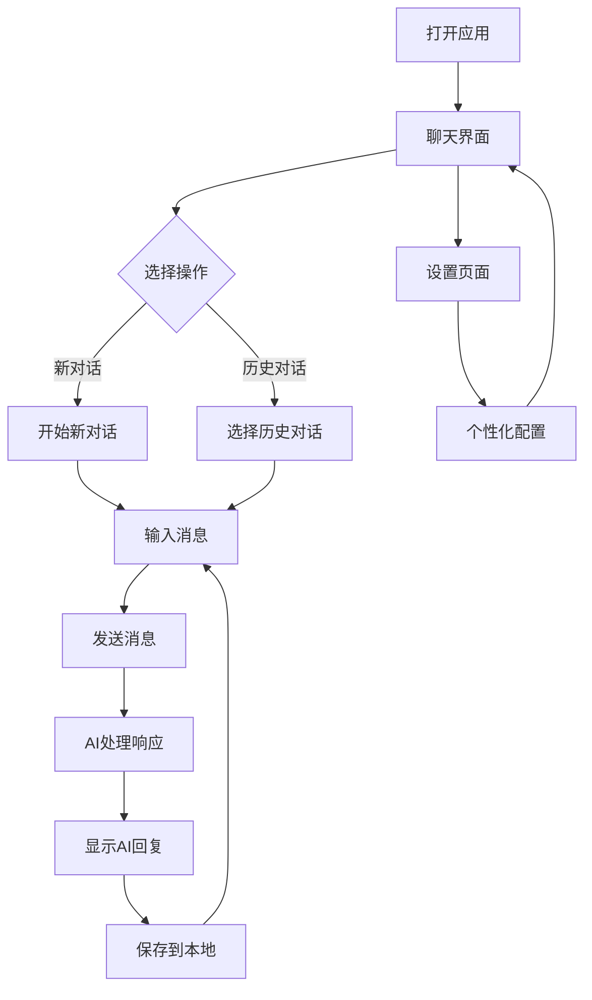

# 极简版AI聊天应用产品需求文档

## 1. 产品概述

一个极简的本地AI聊天工具，用户无需注册登录即可直接与大模型进行对话。所有聊天记录保存在浏览器本地，提供零门槛的AI对话体验。

专注于核心的AI对话功能，为用户提供简单、快速、私密的智能对话服务。

## 2. 核心功能

### 2.1 用户角色
本应用无需用户注册或登录，所有用户都是匿名用户，享有相同的功能权限。

### 2.2 功能模块

我们的极简AI聊天应用包含以下核心页面：
1. **聊天页面**: 主界面，包含对话区域、消息输入框、侧边栏对话列表
2. **设置页面**: 主题切换、字体大小等个性化设置

### 2.3 页面详情

| 页面名称 | 模块名称 | 功能描述 |
|---------|---------|---------|
| 聊天页面 | 对话区域 | 显示用户与AI的对话消息，支持文本消息展示、消息时间戳、消息复制功能 |
| 聊天页面 | 消息输入框 | 用户输入消息的文本框，支持多行输入、发送按钮、字符计数 |
| 聊天页面 | 侧边栏 | 显示历史对话列表，支持新建对话、选择对话、删除对话、对话重命名 |
| 聊天页面 | AI响应区 | 实时显示AI回复，支持流式输出、打字机效果、响应状态指示 |
| 设置页面 | 主题设置 | 切换明暗主题，调整界面外观 |
| 设置页面 | 显示设置 | 调整字体大小、消息密度等显示选项 |
| 设置页面 | 数据管理 | 导出聊天记录、清空本地数据、数据统计 |

## 3. 核心流程

**主要用户操作流程**：
1. 用户打开应用，直接进入聊天界面
2. 可以立即开始新对话或从侧边栏选择历史对话
3. 在输入框中输入消息并发送
4. AI实时响应并显示回复内容
5. 所有对话自动保存到浏览器本地存储
6. 用户可以管理多个对话会话

## 4. 用户界面设计

### 4.1 设计风格
- **主色调**: 蓝色系 (#3B82F6) 作为主色，白色/灰色作为辅助色
- **按钮样式**: 圆角按钮，悬停效果，现代扁平化设计
- **字体**: 系统默认字体，支持14px、16px、18px三种大小
- **布局风格**: 左侧边栏 + 主聊天区域的经典布局，响应式设计
- **图标风格**: 简洁的线性图标，统一的视觉语言

### 4.2 页面设计概览

| 页面名称 | 模块名称 | UI元素 |
|---------|---------|--------|
| 聊天页面 | 侧边栏 | 深色背景(#1F2937)，对话列表卡片，新建对话按钮，设置入口 |
| 聊天页面 | 对话区域 | 白色背景，消息气泡(用户蓝色，AI灰色)，时间戳，滚动区域 |
| 聊天页面 | 输入区域 | 底部固定，白色背景，圆角输入框，发送按钮，字符计数 |
| 聊天页面 | 头部区域 | 对话标题，在线状态指示，菜单按钮 |
| 设置页面 | 设置面板 | 分组设置项，开关按钮，选择器，简洁的表单样式 |

### 4.3 响应式设计
- **桌面优先**: 主要针对桌面端设计，最佳体验在1200px以上屏幕
- **移动适配**: 在移动端侧边栏可收起，聊天区域全屏显示
- **触摸优化**: 按钮和交互元素适配触摸操作，最小44px点击区域

## 5. 技术特性

### 5.1 本地存储
- 所有对话数据存储在浏览器localStorage中
- 支持数据导出为JSON格式
- 提供数据清理和管理功能

### 5.2 AI集成
- 集成GLM-4.6大语言模型
- 支持流式响应，实时显示AI回复
- 智能上下文管理，保持对话连贯性

### 5.3 性能优化
- 虚拟滚动处理长对话历史
- 消息懒加载，提升页面响应速度
- 本地缓存优化，减少重复请求

## 6. 数据隐私

### 6.1 隐私保护
- 无用户账户系统，完全匿名使用
- 所有数据仅存储在用户本地浏览器中
- 不收集任何个人身份信息

### 6.2 数据安全
- 本地数据加密存储
- 提供数据导出和备份功能
- 用户可随时清空所有本地数据

## 7. 使用限制

### 7.1 功能限制
- 仅支持文本对话，暂不支持图片、文件等多媒体
- 对话历史仅在当前浏览器中保存，不同设备间无法同步
- 依赖浏览器localStorage，清理浏览器数据会丢失聊天记录

### 7.2 技术限制
- 需要现代浏览器支持（Chrome 80+, Firefox 75+, Safari 13+）
- 需要稳定的网络连接以访问AI服务
- 单次对话长度限制在合理范围内以保证性能

## 8. 后续扩展

### 8.1 可选功能
- 对话分享功能（生成分享链接）
- 多种AI模型选择
- 对话模板和预设
- 消息搜索功能

### 8.2 高级特性
- 插件系统支持
- 自定义主题
- 快捷键支持
- 离线模式

---

**产品定位**: 这是一个专注于核心功能的极简AI聊天工具，为用户提供无障碍的AI对话体验，同时保护用户隐私，降低使用门槛。